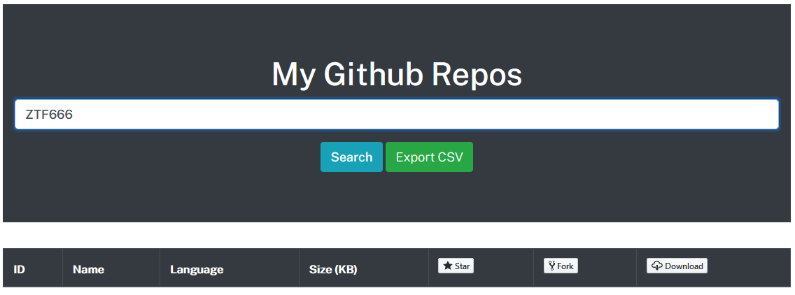
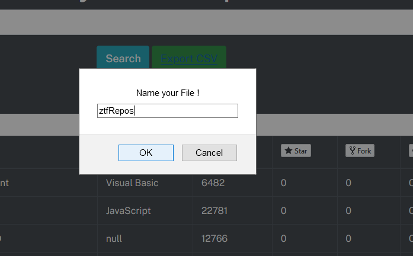
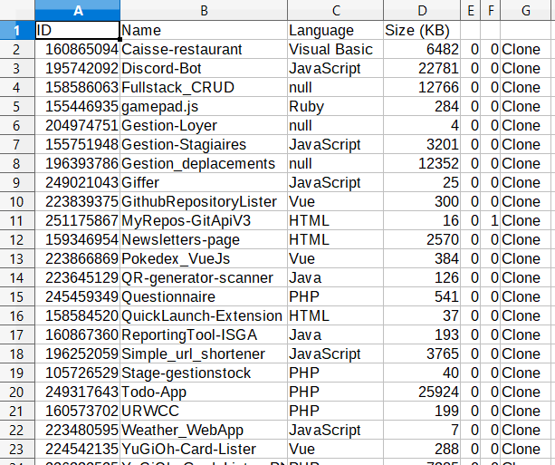
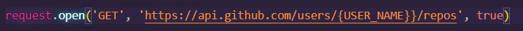
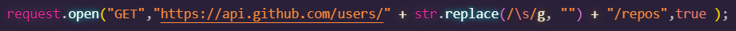

# X's Repos

```
A remake / downgrade of my previous github repos project with VueJs.
This spa returns the repositories of a github user.
Insert the user's name and you'll get all of his public repositories , number of stars , forks and watchers.
```

<div align='center'>

🗂️ [GitRepos VueJS](https://github.com/ZTF666/GithubRepositoryLister) .

📢 [Live Demo](https://gitlister.web.app/)

</div>

```
This time using only jquery and basic js.
No authentication , just unauth requests to the api .
this was made during a small tutoring session i made for a friend .
```

<div align="center">


<h6><strong>XMLH</strong>ttpRequest</h6>
</div>

## Functionnalities

```
Search 👀 : looks up a user on github and displays all of his PUBLIC repos .
```

<div align="center">

</div>

```
Export 📥 : exports a user's public repos into a CSV file .
```

<div align="center">

</div>

```
Example of my repos as a CSV file .
```

<div align="center">

</div>

## Setup

```
Minimal setup required .
Edit the part where it says {USER_NAME} with yours or someone else's and you're done
[IF YOU WANT A STATIC AND FIXED RESULTS] .
```

<div align="center">

</div>

## EDIT : this was changed later on with the search feature implemented .

```
there's no need to edit anything anymore .
```

<div align="center">

</div>

## Limitations

```
Since the request doesn't implement an authentication , you're gonna be limited to 60 requests/hour .
and authentication bumps that to 5K/hour if i recall .
good luck
```

## Contact

```
you can contact me at ZTF666@protonmail.ch

```

<div align="center">

<table>
  <tr>
    <td align="center"><a href="https://ztfportfolio.web.app/" target='_blank'><br /><sub><b>ZTF666</b></sub></a></td>
  </tr>
</table>

</div>

## License

<div align="center">

**🗃️X's Repos🗃️** released under the [MIT](LICENSE) License.
<br><br>
<strong><p>Made with 💘 by a 👨‍💻 on a 💻 | 2020 | ZTF666 </p> </strong>

</div>
